  
  <h1 style="margin-top: 16px;">Maid-san</h1>
  
My CLI with all my necessary tools for work.

## About the Project

This project will center all my tooling like: http client, db view, etc.

## Example of usage
<!--  -->

### Tech Stack

- [Go Lang](https://go.dev/)
- [Sqlite](https://www.sqlite.org/index.html)

### Features

- Http client.
  - Multi workspaces with infinites resources.
  - Variables to use in values.
  - Open response into vim editor.
- Connect with sql databases.
- Connect with mongodb databases.
- Calendar to connect with my google calendar and Alexa
- Review pull requests from github.

## Contact

Twitter - [@gandarfh](https://twitter.com/gandarfh)

## Acknowledgements

- [Bubbletea](https://github.com/charmbracelet/bubbletea)
- [Gorm](https://gorm.io/gorm)
