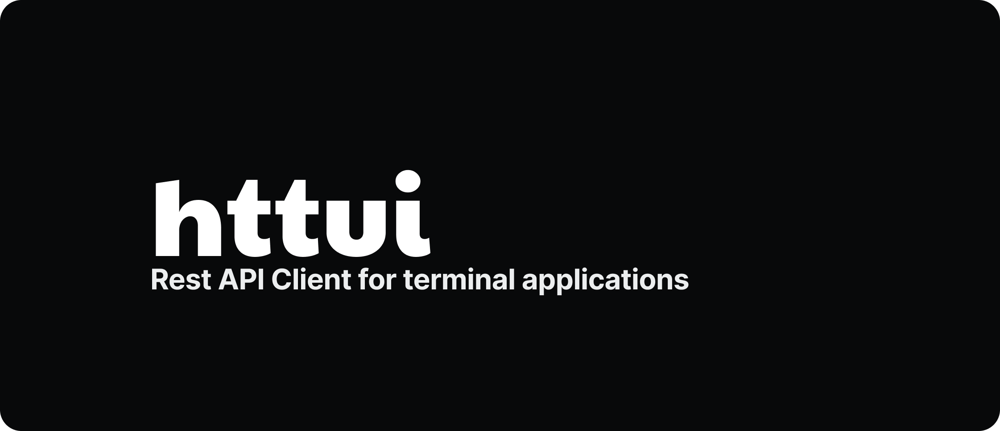

  
  
httui is a Postman/Insomnia alternative

## Introduction

httui was created to manage all my workspaces with rest apis and substitute applications like postman, insomnia, httpie.

## Example

> Create Workspsace

> Create Resource

> Execute Resource with environment variable

### Tech Stack

- [Go Lang](https://go.dev/)
- [Sqlite](https://www.sqlite.org/index.html)
- [Bubbletea](https://github.com/charmbracelet/bubbletea)
- [Gorm](https://gorm.io/gorm)

### Features

- Multi workspaces
- Fast rename (Rename only the name of workspace/tag/environment)
- Filter Resources
- Open in last resource opened
- Move resources between tags
- Custom environment to use in values
- Open response into nvim editor
- Update any information with nvim

## Contact

Twitter - [@gandarfh](https://twitter.com/gandarfh)
